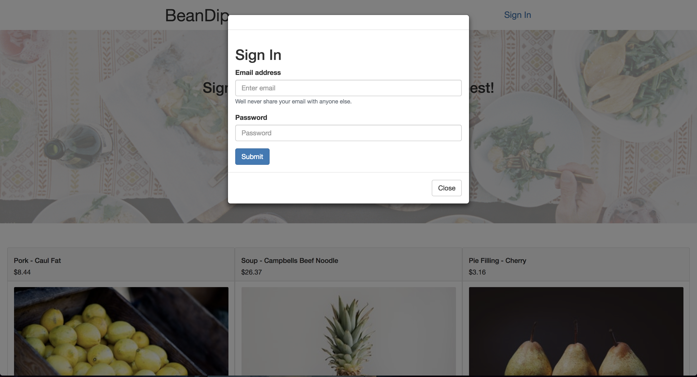
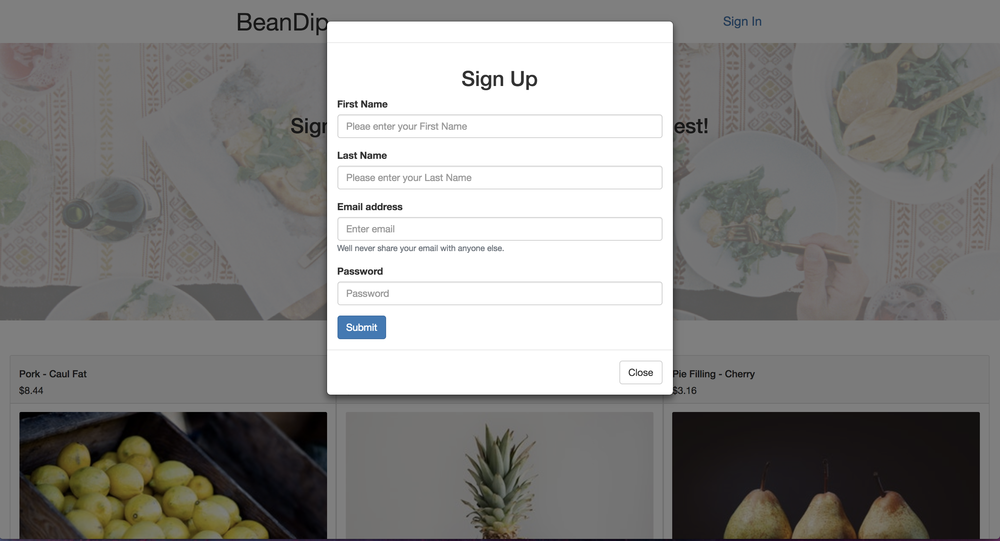
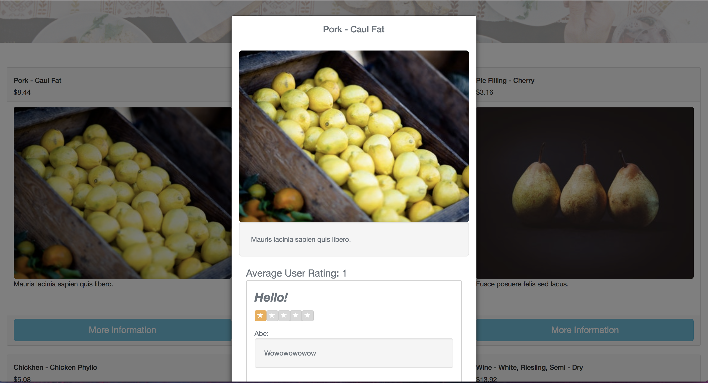

# BeanDip
----
BeanDip is a React application that utilizes Redux and an External API to display
Snacks and the reviews users can leave for the snacks. This app also restricts user access through authorization in the backend.

### Landing Page

### Sign In

### Sign Up

### Snack Info and Reviews

## This Project was developed by
* Claudia Ligidakis [Github](https://github.com/claudialigidakis)
  * Setup the Backend routes and authorization
  * Responsible for CSS design and bootstrap framework
  * Hooked up the CRUD actions for every review
  * Changed content on the page as LocalStorage was created and updated
* Abe Queen [Github](https://github.com/abedababe8)
  * Implemented Redux and React-Bootstrap Components
  * Rendered Components based on Backend API data
  * Managed Redux store state and application state
  * Controlled all Modals and user sign-in/sign-up operations
